# 🛍️ **Netflix-clone Application**

**[Live Demo](https://react-netflix-app-clone.vercel.app/)**

**Netflix-clone Application** is a fully functional, full stack, feature-rich online streaming platform built with **React** and **CSS**, **User Authentication using Firebase**, **storing the user details using FireStore database**. It offers a seamless watching experience with advanced features such as login/Sign up, watching the video. Whether you're browsing for any movies/shows, this app ensures a smooth and responsive experience across all devices.

---

## 🔥 **Key Features**

- **User Authentication using Firebase**: Create account, login/Sign-up using FireBase.
- **FireStore Database**: store the user details using FireStore Database.
- **Login/Sign-up**: Instantly login/sign-up using login page.
- **Fully Responsive Design**: Optimized for mobile, tablet, and desktop.
- **Play the Video**: Select any video to watch and enjoy.
---

## 🖼️ **Screenshots**

### Login/Sign Up Page

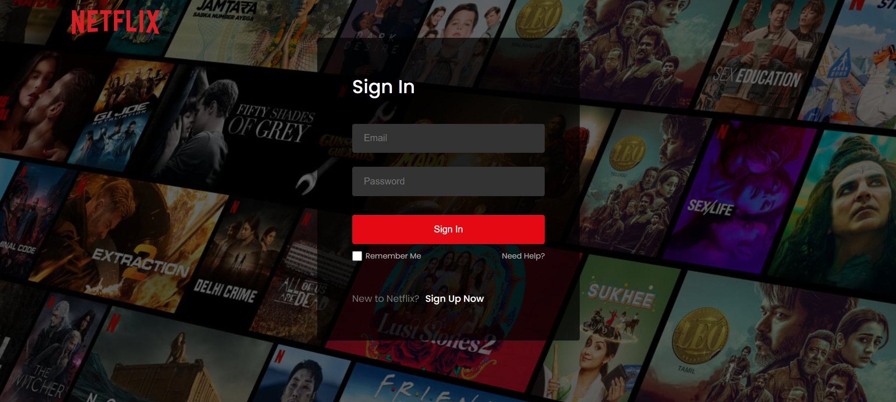  
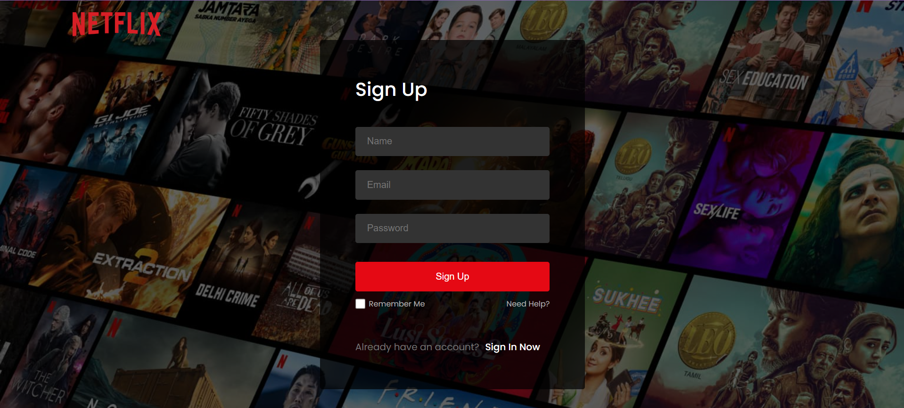 
_The login/signuppage showcases the login/sign-up into application._

### Login/Sign Up Error Page

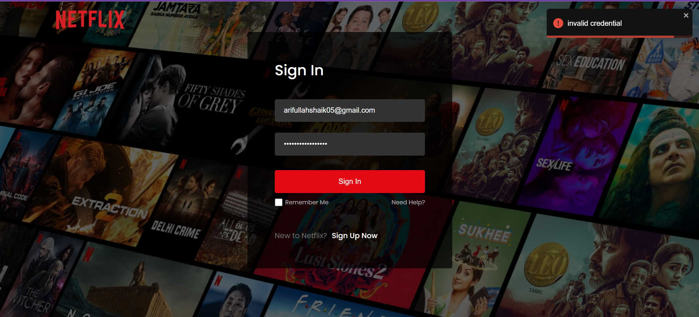  
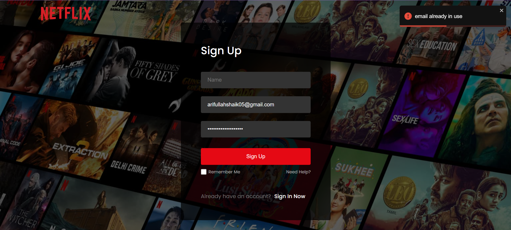 
_The login/signuppage showcases the Error scenarios of login/sign-up page while login/sign-up into application._

### Dashboard Page

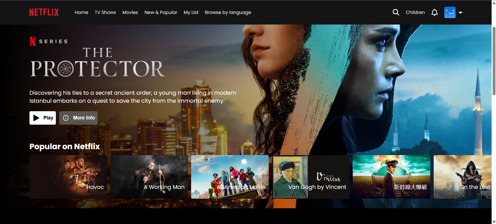  
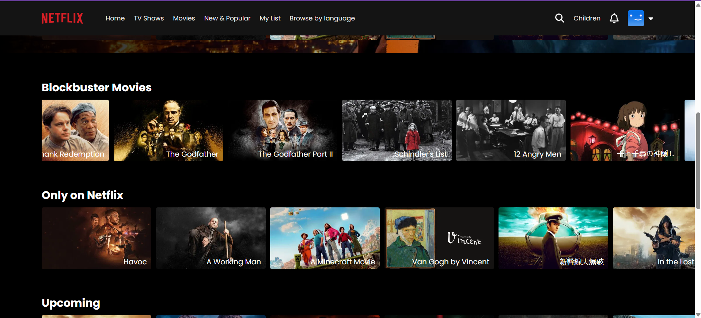  
_Display dashboard page with various sections such as Popular on Netflix, Only on Netflix options._

### Footer Page

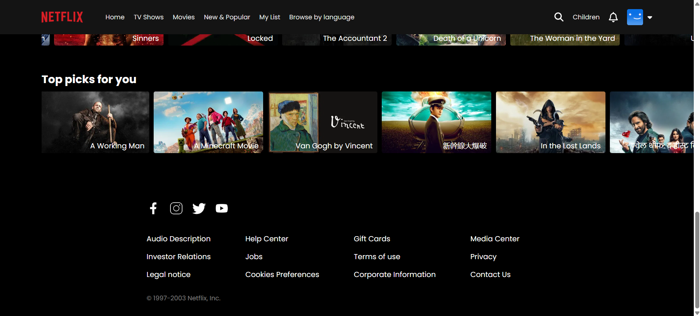  
_Footer section to know more about the application and its mission._

### Video Page

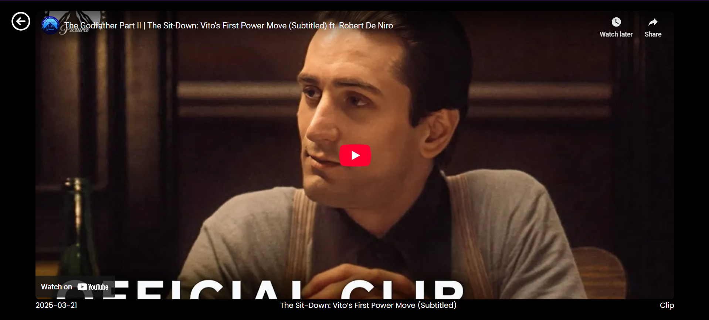  
_Click on any thumbnail to watch the video and enjoy streaming._

---

## 📱 **Responsive Design (Mobile UI)**

The application is fully optimized for mobile devices, ensuring a seamless watching experience on smaller screens. Here are some screenshots of the mobile UI:

| **Login**                                                   | **Dashboard**                                                  | **signup**                                                         |
| ---------------------------------------------------------- | --------------------------------------------------------------- | ---------------------------------------------------------------------- |
| 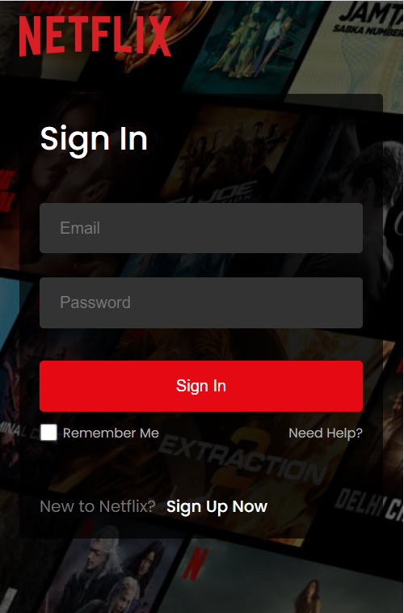 | 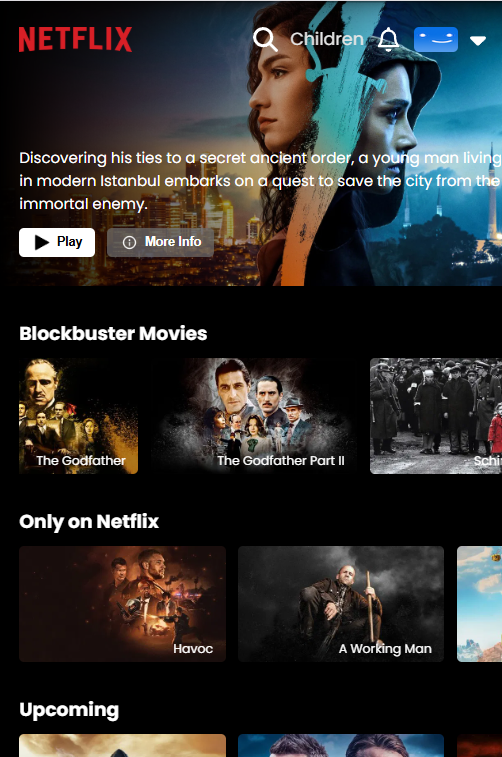 | 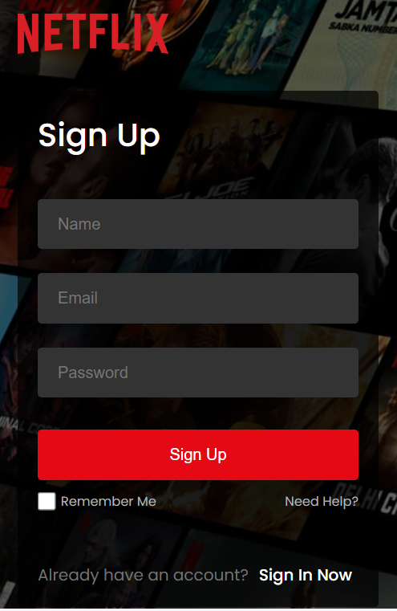 |

| **Dashboard**                                                     | **Video**                                                             |  **Footer**
| -------------------------------------------------------------- | ----------------------------------------------------------------------- | ------------------------------------------------------------- |
|  | 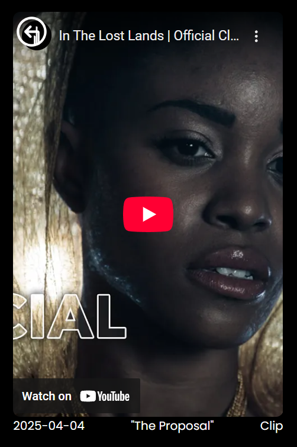 | 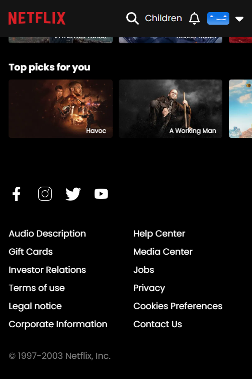 |

---

## 🛠️ **Built With**

- **Frontend**: React, CSS
- **State Management**: React Hooks such as useState, useEffect
- **Routing**: React Router
- **Responsive Design**: CSS (Flexbox)
- **Deployment**: Vercel